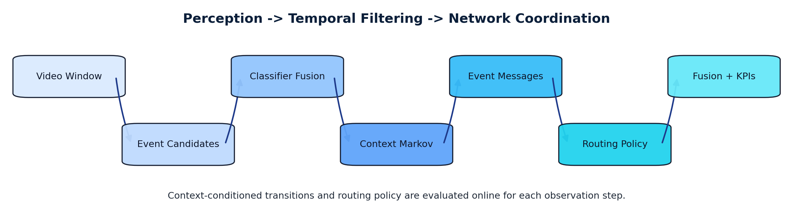
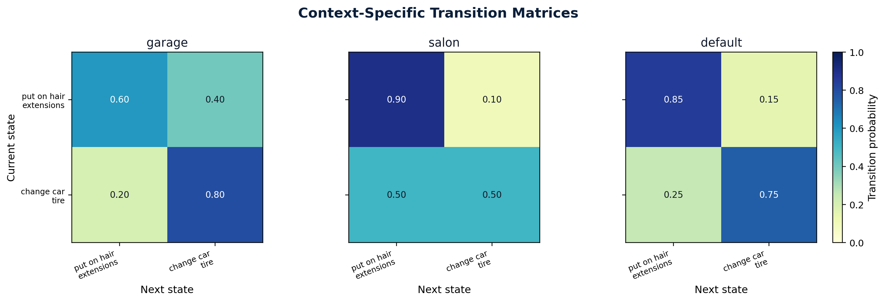
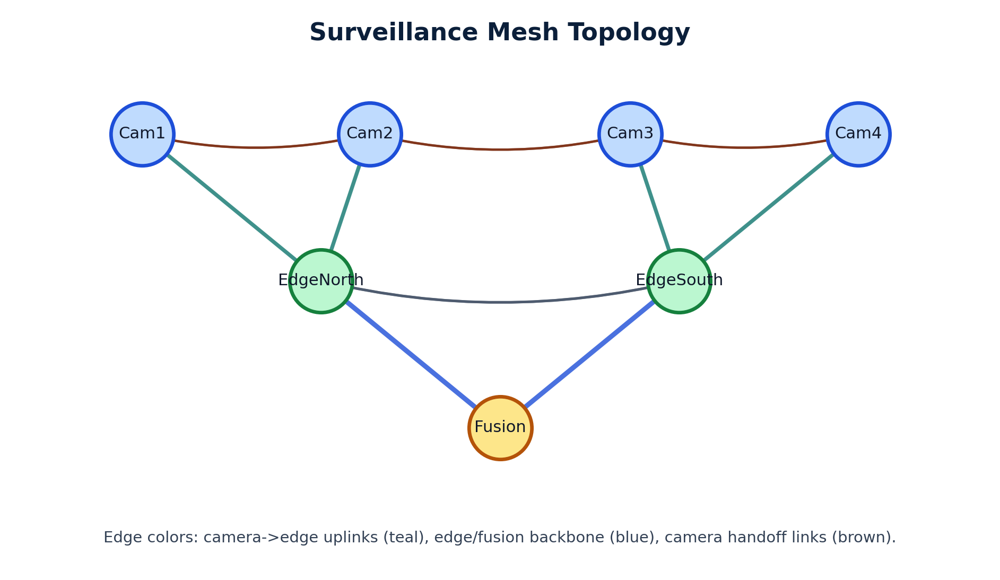
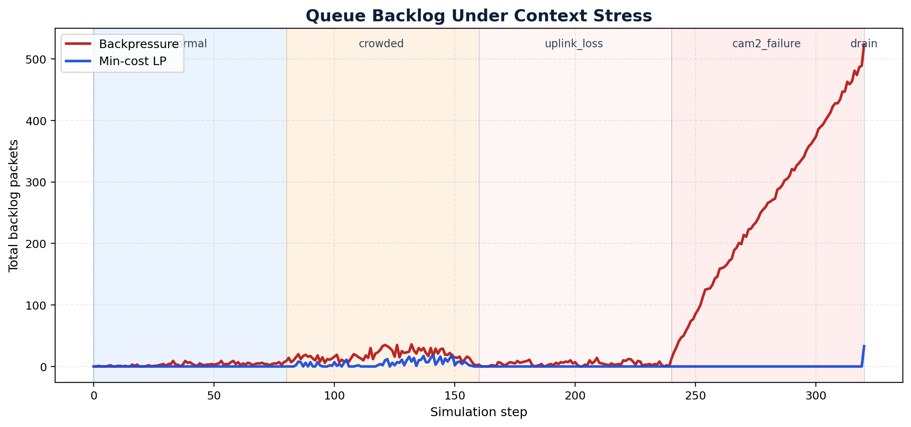
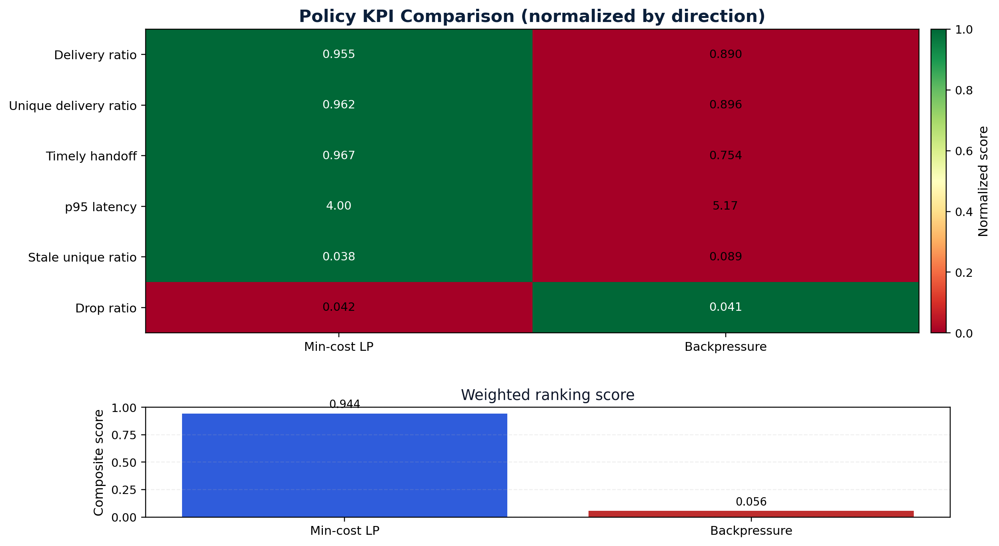

<!-- _class: lead -->
# Networked Context-Conditional Event Inference and Coordination

## HERMES Extension for Multi-Feed Surveillance

- Dynamic event tagging with pluggable classifier sets
- Context-conditional inhomogeneous Markov smoothing
- Message-passing policy evaluation with surveillance KPIs

<div class="small">Artifacts: LaTeX paper + web HTML deck + static PDF deck</div>

---

# Operational Problem

Distributed surveillance has to optimize two loops at the same time:

1. Event state estimation quality over time
2. Cross-node coordination speed and reliability

<div class="kpi">
  <div><strong>Failure 1</strong><br/>stale handoff packets under context shifts</div>
  <div><strong>Failure 2</strong><br/>duplicate alerts and inflated downstream load</div>
  <div><strong>Failure 3</strong><br/>queue buildup with delayed recovery after disruptions</div>
</div>

---

# What This System Implements

## Inference stack

- taxonomy-driven candidate routing
- prototype, binary, and custom observation classifiers
- context-conditional Markov updates (`window_size`, `markov_order`)
- optional symbolic transfer entropy diagnostics

## Coordination stack

- directed network packet simulator
- `min_cost_lp` and `backpressure` routing policies
- weighted KPI ranking for deployment-specific policy choice

---

<!-- _class: wide -->
# End-to-End Pipeline



---

# Dynamic Tagging + Context Markov

Posterior update per step:

$$
\hat{p}_t = p_{t-1} T_{c_t,t}, \quad p_t(e) \propto \hat{p}_t(e)\tilde{p}_t(e)
$$

- $\tilde{p}_t$: fused observation scores from your classifier set
- $T_{c_t,t}$: context-conditioned transition matrix (ecological context)

Implementation controls:

- `markov_order` for higher-memory blending
- `window_size` for online sliding-window refiltering
- optional symbolic transfer entropy diagnostics

---

<!-- _class: wide -->
# Context-Specific Transition Matrices



---

# Live User Flow

1. Start feed processing and select initial ecological context.
2. For each observation window, run classifier set and update Markov posterior.
3. Emit event messages (`alert`, `track`, `handoff`, `heartbeat`) to the network layer.
4. Route messages with selected policy (`min_cost_lp` or `backpressure`).
5. Inspect live state: classifications, transition matrix, posterior, queue pressure, KPI drift.
6. Adjust context/hyperparameters online and monitor adaptation.

---

<!-- _class: wide -->
# Surveillance Topology Under Test



---

<!-- _class: wide -->
# Context Stress Timeline (Single Run)



Takeaway: backlog response differs strongly by policy during `crowded`, `uplink_loss`, and `cam2_failure` phases.

---

<!-- _class: wide -->
# Policy KPI Comparison (Monte Carlo)



---

# KPI Interpretation

- Higher is better for delivery and handoff metrics.
- Lower is better for latency, stale ratio, and drop ratio.
- Weighted score summarizes deployment priorities into one policy decision metric.

---

<!-- _class: tight -->
# Hyperparameter Experiment Matrix

| Component | Sweep Parameters | Typical Range |
|---|---|---|
| Context Markov | `markov_order`, `window_size` | `1..4`, `4..24` |
| Transfer entropy | `transfer_entropy_target_order`, `transfer_entropy_source_order` | `1..4`, `1..4` |
| LP routing | `alpha_delay`, `alpha_distance`, `alpha_downstream_queue` | continuous positive |
| Backpressure | `delay_weight` | `0.0..1.0` |
| Network stress | context schedule + capacity/loss scaling | scenario-driven |

Goal: optimize handoff timeliness and stale-delivery suppression without destabilizing queues.

---

# Coordination and Message-Passing Validation

1. Run deterministic scenario checks (fixed seed, fixed context schedule).
2. Run Monte Carlo batches for policy confidence intervals.
3. Compare delivery, latency, stale, duplicate, and recovery metrics.
4. Apply weighted ranking profiles per deployment objective.
5. Promote policy and hyperparameter profile that dominates target KPI set.

---

<!-- _class: tight -->
# Reproducible Build + Run Commands

```bash
# build paper PDF
bash run_scripts/papers/build_networked_contextual_hermes_paper.sh

# generate visuals + build web HTML and static PDF slides
bash run_scripts/presentations/build_networked_contextual_hermes_slides.sh

# refresh sim data used in visuals
REBUILD_DATA=1 bash run_scripts/presentations/build_networked_contextual_hermes_visuals.sh
```

---

<!-- _class: darkband -->
# Current Limits and Next Work

- Simulator is synthetic packet-level coordination, not full telemetry replay.
- LP policy is receding-horizon one-step optimization.
- Joint compute scheduling + routing optimization is not yet integrated.

Next work:

1. ingest real camera/network traces
2. add automated policy/hyperparameter tuning
3. generate benchmark reports with publication-ready tables and figures
